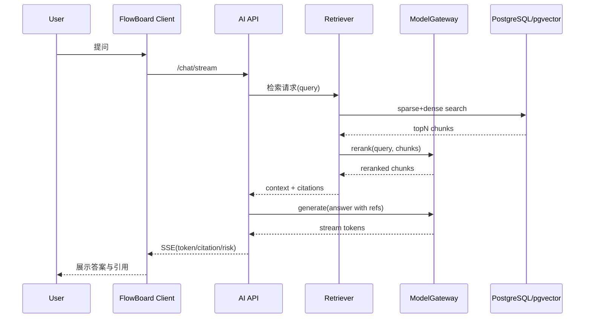
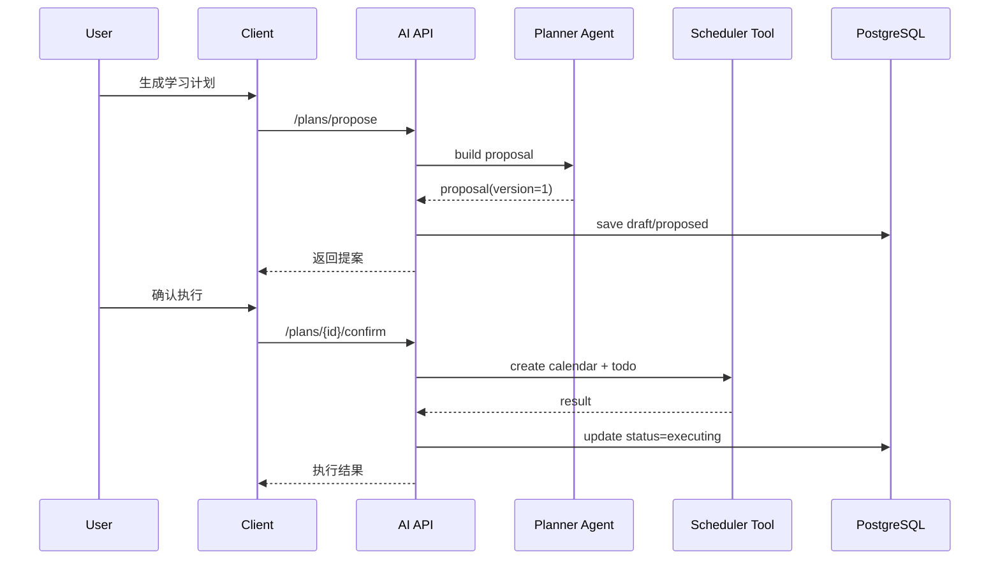
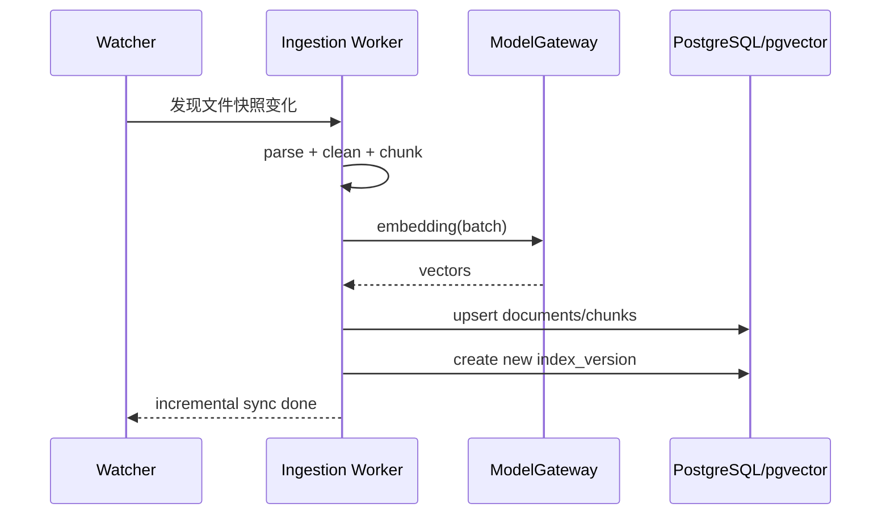
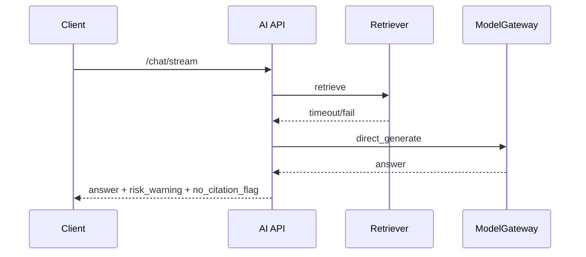

# FlowBoard 个人提升栏目 AI RAG + Agent 企业级方案（单一最优解）

## 0. 文档说明

- 文档定位：面向架构设计、研发落地、测试验收、上线发布的一体化方案
- 适用范围：FlowBoard 桌面端（Windows/macOS）个人提升栏目
- 输入来源：`AI_AGENT_ANSWER.md` 1-80 条需求约束
- 目标：给出 1 套可直接执行的主流企业级方案，并覆盖架构、数据模型、接口、时序图、实施计划、风险与上线清单

## 1. 需求约束归一化

### 1.1 业务目标与优先级

1. 能力优先级：学习规划 > 任务拆解 > 知识问答 > 进度复盘
2. 第一阶段要求四个能力全部上线
3. 用户画像：5 年内社招和学生，ToC 单用户为主
4. 成功标准：回答命中率高，答案准确性优先于召回全面性和速度

### 1.2 AI 能力边界

1. 支持场景：学习规划、任务拆解、知识问答、进度复盘、面试录音复盘
2. 产物类型：Markdown、PDF
3. 支持文件输入：audio、pdf、docx、txt、md
4. 需要多轮上下文、长期记忆、可解释引用
5. 需要多 Agent 协作 + 人类在环 + 可恢复任务 + 计划可视化
6. 制定计划时必须先提案后确认；删除和批量修改必须二次确认

### 1.3 RAG 与检索约束

1. 数据源：本地 docs 目录
2. 增量同步：实时，不要求变更追踪
3. 混合检索 + rerank + 中英文检索
4. 置信度低于 90% 增加风险提示
5. 需要离线与在线评测闭环
6. 监控指标：检索命中率、无答案率、工具调用成功率、成本、延迟

### 1.4 非功能约束

1. 性能目标：P50 < 1s，P95 < 3s（建议按首 token SLA 定义）
2. 成本上限：150 RMB/月
3. 平台：macOS + Windows
4. 部署现状：GitHub Actions，阿里云
5. 不要求高可用、不要求多租户、不要求弱网可用
6. 需要版本管理、回滚能力、故障降级策略
7. 安全重点：提示词注入防护、数据泄露防护

## 2. 单一最优技术路线

## 2.1 结论

采用 本地优先 + 云增强 的单体可演进架构，并对框架层做明确绑定：

- 客户端：Electron（现有 FlowBoard）
- AI 服务层：Python FastAPI 单服务（模块化单体）
- 编排层：LangGraph（生产级状态机编排，支持 checkpoint 与 human-in-loop）
- Agent/RAG 组件层：LangChain（LCEL + Tools + Memory 抽象）
- 观测评测层：LangSmith（trace、评测、prompt 版本管理）
- 可选补充层：LlamaIndex（偏文档 ingestion/index 管线时按需引入）
- 数据层：PostgreSQL 16 + pgvector（统一结构化数据与向量索引）
- 缓存与队列：Redis（缓存 + Redis Streams 任务队列）
- 对象存储：本地文件系统（默认）+ 阿里云 OSS（可选备份）
- 模型网关：统一 Model Gateway，适配 Qwen/Kimi，可热切换

这套方案是当前约束下的最优解：主流、可维护、可扩展、满足企业级工程要求，同时在单用户场景可控成本内运行。

## 2.2 为什么不是其它方案

| 方案 | 优点 | 缺点 | 结论 |
|---|---|---|---|
| 纯本地轻量（SQLite + 本地 embedding） | 成本低、隐私强 | 难稳定达到企业级可扩展、rerank 与评测体系弱 | 不选 |
| 全云微服务（ES/Milvus/Kafka） | 可扩展性最强 | 复杂度和成本高，不匹配单用户阶段 | 不选 |
| 本方案（FastAPI + LangGraph + LangChain + PG + Redis + LangSmith） | 主流、成本可控、可演进、工程治理完整 | 初期需搭建规范工程骨架 | 选用 |

## 2.3 框架层职责边界（明确绑定）

| 层级 | 选型 | 核心职责 | 本项目落地点 |
|---|---|---|---|
| 编排层 | LangGraph | 多 Agent 工作流状态机、可恢复执行、人工确认节点 | 计划提案-确认-执行、二次确认、失败恢复 |
| Agent/RAG 组件层 | LangChain | LCEL 编排、Retriever/Tool/Memory 统一抽象 | 混合检索链、工具调用链、会话与记忆适配 |
| 观测评测层 | LangSmith | Trace、在线回放、评测数据集、Prompt 版本管理 | 线上问题定位、离线评测闭环、Prompt 迭代治理 |
| 可选补充层 | LlamaIndex | 文档 ingestion/index 高阶管线 | 文档规模扩大或结构复杂后引入 |

## 2.4 AI 框架技术栈清单（对外口径）

1. 编排：LangGraph
2. Agent/RAG：LangChain（LCEL + Tools + Memory）
3. 观测评测：LangSmith（trace、评测、prompt 版本）
4. 文档索引增强：LlamaIndex（可选）

## 3. 总体架构设计

## 3.1 分层架构

```text
┌────────────────────────────────────────────────────────────────────┐
│                         FlowBoard Electron                         │
│  Personal Growth UI / Plan Visualization / Confirmation Dialogs   │
└────────────────────────────────────────────────────────────────────┘
                     │ HTTPS + SSE(流式输出)
┌────────────────────────────────────────────────────────────────────┐
│                        AI Orchestrator API                         │
│ FastAPI                                                           │
│ ├─ Session API / Chat API / Plan API / Task API / RAG API        │
│ ├─ LangGraph Runtime (workflow/checkpoint/HITL)                  │
│ ├─ LangChain LCEL (retriever/tools/memory abstraction)           │
│ ├─ Agent Runtime (Planner/Decomposer/RAG QA/Review/Scheduler)    │
│ ├─ Tool Runtime (calendar/todo/search/export)                    │
│ └─ Confidence & Risk Engine                                       │
└────────────────────────────────────────────────────────────────────┘
       │                         │                         │                         │
       │                         │                         │                         │
┌──────────────┐       ┌─────────────────┐       ┌──────────────────┐     ┌────────────────┐
│ ModelGateway │       │ Retrieval Layer │       │ Ingestion Worker │     │ LangSmith      │
│ Qwen/Kimi    │       │ Hybrid + Rerank │       │ Parse/Chunk/Index│     │ Trace/Eval/PM  │
└──────────────┘       └─────────────────┘       └──────────────────┘     └────────────────┘
       │                         │                         │                         │
       └───────────────┬─────────┴─────────┬──────────────┴──────────────┘
                       │                   │
              ┌────────────────┐   ┌────────────────────┐
              │ PostgreSQL+PGV │   │ Redis Cache/Stream │
              │ metadata+vector │   │ cache+queue+locks  │
              └────────────────┘   └────────────────────┘
```

## 3.2 关键设计原则

1. 单体优先，边界清晰：先做模块化单体，后续按边界拆服务
2. 默认本地数据：文档与索引默认保存在本地；用户可选择允许云模型处理
3. 统一网关：模型、检索、工具调用都走统一治理层
4. 策略前置：高风险操作必须经过确认
5. 可回滚：索引版本、计划版本、任务版本都可回退

## 4. 模块详细设计

## 4.1 Model Gateway（模型可替换）

### 4.1.1 目标

1. 解耦模型供应商（Qwen/Kimi）
2. 统一调用协议：chat、embedding、rerank、asr
3. 统一超时、重试、熔断、成本统计

### 4.1.2 接口契约

```text
generate(messages, model_profile, tools, temperature, timeout_ms)
embed(texts, embedding_profile)
rerank(query, passages, rerank_profile)
transcribe(audio_uri, asr_profile)
```

### 4.1.3 模型路由策略

1. 默认路径：Qwen 主路由，Kimi 备路由
2. 异常降级：RAG 失败或超时时走直接问答并附风险提示
3. 成本控制：按能力路由
   - 规划/拆解：高质量模型
   - 检索问答：中等模型 + rerank
   - 结构化提取：低成本模型

## 4.2 RAG 数据接入与索引

### 4.2.0 框架落地方式（LangChain + 可选 LlamaIndex）

1. LangChain 作为默认 RAG 组件框架
   - Loader/Parser 适配器统一封装
   - TextSplitter 与 Retriever 统一抽象
   - LCEL 负责检索链、重排链、生成链拼接
2. LlamaIndex 作为可选增强
   - 当文档结构复杂、层级深、索引策略需要快速试验时引入
   - 仅用于 ingestion/index 管线，不替代主编排与观测体系

### 4.2.1 数据源与接入

支持用户指定目录的全量扫描 + 实时增量同步：

1. 文件类型：pdf/docx/txt/md/audio
2. 增量判定：`(path, size, mtime, sha256)` 快照比对
3. 不做复杂变更追踪，只做增量重建，满足当前需求

### 4.2.2 解析与清洗

1. 文本抽取：
   - PDF：pdfminer 或 pymupdf
   - DOCX：python-docx
   - Markdown/TXT：原生解析
   - Audio：ASR 转写（中文优化）
2. 清洗规则：
   - 去页眉页脚、去目录噪声、去重复段落
   - 标准化中英文标点与空白字符
3. 低质量过滤：
   - 长度阈值
   - 重复率阈值
   - 文本有效字符占比阈值

### 4.2.3 分块策略

建议采用 语义分段 + 固定窗口 混合切分：

1. 语义切分：按标题、列表、段落边界优先
2. 窗口切分：`chunk_size=500~700 tokens`，`overlap=80~120 tokens`
3. 每块元数据：
   - `doc_id`、`doc_version`
   - `section_path`
   - `chunk_index`
   - `source_uri`
   - `lang`
   - `created_at`

### 4.2.4 混合检索

检索链路：

1. Query 改写与归一化（中英文术语扩展）
2. 稀疏检索：PostgreSQL FTS（BM25 近似）
3. 稠密检索：pgvector ANN
4. 融合：RRF（Reciprocal Rank Fusion）
5. rerank：Cross-Encoder 或供应商 rerank API
6. TopK 输出：`top_k_context=6~10`

LCEL 形态建议：

```text
query_normalize -> hybrid_retrieve -> rrf_merge -> rerank -> citation_pack -> answer_generate
```

### 4.2.5 可解释引用

回答中每个关键结论必须附引用块：

```text
[ref-1] 文件名#章节 路径:xxx 行号:xx-yy 版本:v12
[ref-2] 文件名#章节 路径:xxx 行号:aa-bb 版本:v12
```

UI 支持点击引用回溯到原文片段。

### 4.2.6 版本与回滚

1. 每次索引构建生成 `index_version`
2. 查询请求绑定 `index_version`，保证可复现
3. 回滚通过 `active_index_version` 指针切换
4. 保留最近 N 个版本（建议 N=5）

## 4.3 Agent 体系设计（基于 LangGraph）

## 4.3.1 多 Agent 角色

1. Planner Agent
   - 输入目标，输出学习计划提案
2. Decomposer Agent
   - 将计划拆成可执行任务与里程碑
3. RAG QA Agent
   - 执行检索问答并产出引用
4. Review Agent
   - 对计划与回答做一致性检查、风险校验
5. Scheduler Agent
   - 写入日程、更新待办、可恢复任务推进

## 4.3.2 状态机（核心）

```text
INIT
  -> CONTEXT_LOAD
  -> INTENT_CLASSIFY
  -> PLAN_PROPOSAL (如果是计划制定)
  -> USER_CONFIRM (必须)
  -> EXECUTION
  -> SELF_CHECK
  -> OUTPUT
  -> MEMORY_WRITE
  -> END
```

分支策略：

1. 删除/批量修改：`USER_CONFIRM` 二次确认，失败则中断
2. 低置信度：进入 `RISK_OUTPUT` 分支
3. 工具失败：进入 `DEGRADE` 分支

LangGraph 落地要求：

1. 节点持久化：关键节点写 checkpoint（proposal/confirm/execution）
2. 边条件显式化：确认失败、置信度不足、工具失败分别有独立分支
3. 可恢复执行：任务重试从最近 checkpoint 恢复，不重复副作用步骤

## 4.3.3 人类在环策略

强制确认清单：

1. 学习计划创建与覆盖更新
2. 批量修改待办
3. 删除类操作
4. 外部抓取公开资料并写入知识库

确认协议：

1. 提案摘要
2. 影响范围
3. 可撤销窗口
4. 用户确认 token（yes/no）

## 4.3.4 可恢复任务

1. 每个任务有 `state + checkpoint + retry_count`
2. 中断后可从最近 checkpoint 恢复
3. 超过重试阈值自动挂起，待人工处理

## 4.4 记忆体系

满足 短期会话记忆 + 长期用户偏好记忆 + 任务记忆 三层：

1. 短期会话记忆
   - 生命周期：会话级
   - 内容：最近 N 轮对话摘要 + 关键约束
2. 长期偏好记忆
   - 生命周期：长期
   - 内容：用户目标偏好、语言风格、学习节奏
3. 任务记忆
   - 生命周期：任务生命周期
   - 内容：计划版本、任务状态、执行日志、回滚点

写入策略：

1. 先写短期，再异步提炼长期
2. 长期写入必须通过冲突合并规则，避免污染
3. 任务记忆与计划版本强绑定，支持追溯

实现建议：使用 LangChain Memory 抽象作为接口层，底层仍落 PostgreSQL，避免框架耦合导致迁移困难。

## 4.5 工具调用体系

当前能力工具化建议：

1. Calendar Tool：创建与更新日程
2. Todo Tool：创建、批量修改、删除待办（带确认）
3. Search Tool：抓取公开资料
4. Export Tool：导出 Markdown/PDF

工具注册协议统一：

```json
{
  "name": "calendar.create_event",
  "input_schema": {},
  "requires_confirmation": true,
  "idempotency_key": "..."
}
```

## 4.6 观测与评测体系（LangSmith）

1. Trace 追踪
   - 每次会话、检索、工具调用、模型调用都生成 trace/span
   - 生产问题可按 session_id 一键回放
2. 评测集治理
   - 离线数据集版本化，区分规划/拆解/问答/复盘四类场景
   - 每次 prompt 或路由策略变更后自动回归评测
3. Prompt 版本管理
   - 系统提示词、角色提示词、工具提示词全部版本化
   - 支持灰度比较与回滚
4. 线上质量闭环
   - 将低置信、用户差评、无答案样本自动沉淀为评测样本
   - 与离线评测形成持续迭代闭环

## 5. 数据模型草案（Database Draft）

## 5.1 核心表清单

| 表名 | 用途 |
|---|---|
| users | 用户主表（单用户场景可固定 1 条） |
| sessions | 会话元信息 |
| messages | 对话消息 |
| memory_short_term | 会话短期记忆 |
| memory_long_term | 用户长期偏好记忆 |
| plans | 学习计划主表 |
| plan_versions | 计划版本表 |
| tasks | 任务主表 |
| task_runs | 任务执行记录与恢复点 |
| rag_documents | 文档元数据 |
| rag_doc_versions | 文档版本 |
| rag_chunks | 分块与向量索引 |
| rag_index_versions | 索引版本 |
| retrieval_logs | 检索日志与命中结果 |
| tool_invocations | 工具调用记录 |
| risk_events | 风险事件记录 |
| eval_offline_runs | 离线评测结果 |
| eval_online_metrics | 在线指标快照 |

## 5.2 关键字段示例

### plans

| 字段 | 类型 | 说明 |
|---|---|---|
| id | uuid | 主键 |
| user_id | uuid | 用户 ID |
| title | text | 计划标题 |
| status | varchar(32) | draft/proposed/confirmed/executing/completed |
| current_version | int | 当前版本号 |
| created_at | timestamptz | 创建时间 |
| updated_at | timestamptz | 更新时间 |

### plan_versions

| 字段 | 类型 | 说明 |
|---|---|---|
| id | uuid | 主键 |
| plan_id | uuid | 计划 ID |
| version_no | int | 版本号 |
| content_md | text | Markdown 内容 |
| change_summary | text | 变更摘要 |
| confirmed_by_user | bool | 是否用户确认 |
| created_at | timestamptz | 创建时间 |

### rag_chunks

| 字段 | 类型 | 说明 |
|---|---|---|
| id | uuid | 主键 |
| doc_version_id | uuid | 文档版本 ID |
| chunk_index | int | 分块序号 |
| content | text | 分块内容 |
| embedding | vector(1024) | 向量 |
| tsv | tsvector | 全文检索字段 |
| lang | varchar(8) | zh/en/mix |
| token_count | int | token 数 |
| quality_score | numeric(5,2) | 质量分 |

### task_runs

| 字段 | 类型 | 说明 |
|---|---|---|
| id | uuid | 主键 |
| task_id | uuid | 任务 ID |
| state | varchar(32) | pending/running/paused/failed/success |
| checkpoint | jsonb | 恢复点 |
| retry_count | int | 重试次数 |
| error_code | varchar(64) | 错误码 |
| started_at | timestamptz | 开始时间 |
| ended_at | timestamptz | 结束时间 |

## 5.3 索引建议

1. `rag_chunks(embedding)` 建立 ivfflat/hnsw 索引
2. `rag_chunks(tsv)` 建立 gin 索引
3. `messages(session_id, created_at)` 复合索引
4. `tasks(plan_id, status)` 复合索引
5. `retrieval_logs(created_at)` 分区表（月分区）

## 6. API 草案（API Draft）

统一前缀：`/api/v1`

## 6.1 会话与问答

### POST /chat/stream

用途：多轮对话、RAG 问答、流式输出

请求示例：

```json
{
  "session_id": "uuid",
  "query": "帮我拆解三个月的后端学习计划",
  "mode": "auto",
  "context": {
    "plan_id": null,
    "language": "zh-CN"
  }
}
```

响应：SSE，事件包括 `token`、`citation`、`risk`、`done`

### POST /chat/evaluate-confidence

用途：对回答计算置信度与风险等级

返回：

```json
{
  "confidence": 0.87,
  "risk_level": "medium",
  "need_warning": true
}
```

## 6.2 学习计划与任务

### POST /plans/propose

用途：生成学习计划提案，不直接执行

### POST /plans/{plan_id}/confirm

用途：用户确认提案并进入执行态

### POST /plans/{plan_id}/rollback

用途：回滚到指定版本

请求：

```json
{
  "target_version": 3,
  "reason": "当前版本过于激进"
}
```

### POST /tasks/batch-update

用途：批量修改任务，必须二次确认

## 6.3 RAG 数据源与索引

### POST /rag/sources

用途：添加本地目录数据源

```json
{
  "source_type": "local_dir",
  "path": "/Users/xxx/Documents/docs",
  "auto_sync": true
}
```

### POST /rag/index-jobs

用途：触发全量或增量索引

```json
{
  "source_id": "uuid",
  "mode": "incremental"
}
```

### GET /rag/index-versions

用途：查看索引版本并切换激活版本

## 6.4 工具执行

### POST /tools/execute

```json
{
  "tool_name": "calendar.create_event",
  "arguments": {
    "title": "系统设计学习",
    "start_time": "2026-03-01T20:00:00+08:00",
    "duration_minutes": 90
  },
  "confirm_token": "required-if-policy-hit"
}
```

## 6.5 评测与监控

### POST /eval/offline/run

用途：执行离线评测任务

说明：默认对接 LangSmith 数据集与评测作业。

### GET /metrics/realtime

用途：返回命中率、无答案率、工具成功率、成本、延迟

说明：在线指标与 LangSmith trace 关联，支持按 session_id 回放。

## 6.6 错误码规范

| 错误码 | 说明 |
|---|---|
| AI-4001 | 参数非法 |
| AI-4010 | 未确认高风险操作 |
| AI-4040 | 资源不存在 |
| AI-4090 | 版本冲突 |
| AI-4290 | 预算超限 |
| AI-5001 | 模型调用失败 |
| AI-5002 | 检索超时 |
| AI-5003 | 工具执行失败 |

## 7. 关键时序图（含时序图）

## 7.1 知识问答链路



## 7.2 学习计划提案-确认-执行链路



## 7.3 增量索引链路



## 7.4 故障降级链路



## 8. 性能与成本设计

## 8.1 性能预算

建议将 SLA 解释为 首 token 延迟：

| 环节 | P50 预算 | P95 预算 |
|---|---:|---:|
| Query 归一化 | 30ms | 80ms |
| 混合检索 | 180ms | 600ms |
| rerank | 200ms | 700ms |
| LLM 首 token | 450ms | 1400ms |
| 总计 | 860ms | 2780ms |

## 8.2 性能优化点

1. Query Result Cache（短 TTL）
2. 预热高频文档向量页
3. rerank 限流到 Top40
4. Streaming 优先返回摘要句
5. 异步写入日志与指标

## 8.3 成本测算（150 RMB/月上限）

控制策略：

1. 默认使用中档模型，仅在复杂规划时升级
2. embedding 与索引走批量任务，避开高峰
3. 引入月预算器：超阈值自动降级到低成本档

成本分配建议：

| 项目 | 月预算 |
|---|---:|
| LLM 调用 | 90 RMB |
| embedding/rerank | 35 RMB |
| 云资源（轻量） | 25 RMB |
| 合计 | 150 RMB |

## 9. 安全设计

## 9.1 提示词注入防护

四层防护：

1. 输入预过滤：命令注入、越权指令模式识别
2. 检索隔离：只允许白名单知识源进入上下文
3. 工具沙箱：工具参数 schema 校验 + 权限校验
4. 输出审查：检测越权、泄露、幻觉高风险模式

## 9.2 数据泄露防护

1. 默认本地处理，云调用需用户显式同意
2. 对外发送时仅发送最小必要上下文
3. 敏感操作审计到 `risk_events`
4. 不做默认脱敏（按现阶段要求），但保留策略开关

## 9.3 访问与密钥

1. API Key 本地加密存储（系统凭据库）
2. 服务端密钥不落日志
3. 工具调用使用最小权限原则

## 10. 评测与监控闭环

## 10.1 离线评测

数据集构成：

1. 学习规划样本
2. 任务拆解样本
3. 知识问答样本（中英混合）
4. 复盘样本（含音频转写）

执行方式：以 LangSmith 数据集与评测任务为主，离线批处理由 CI 定时触发。

指标：

1. Answer Accuracy
2. Citation Faithfulness
3. Retrieval Recall@K
4. Tool Success Rate
5. Hallucination Rate

## 10.2 在线评测

1. 命中率（有引用且可回溯）
2. 无答案率
3. P50/P95 首 token 延迟
4. 用户确认通过率（提案质量代理指标）
5. 成本与 token 消耗

执行方式：线上链路默认写入 LangSmith trace，支持按会话回放与根因定位。

## 10.3 风险提示策略

当 `confidence < 0.9` 时，统一附加风险提示：

```text
当前答案置信度低于 90%，建议你点击引用核验关键结论，必要时让我继续补充检索。
```

## 11. 实施计划（8 期交付）

上线目标：2026-10-01  
节奏：前 6 期做功能建设，后 2 期做优化与上线准备

## 11.1 期次规划

### 第 1 期（基础底座）

1. FastAPI 工程骨架
2. LangGraph + LangChain 基础骨架
3. Model Gateway（Qwen/Kimi）
4. PostgreSQL + pgvector + Redis 初始化
5. 会话 API 与流式输出

验收：可完成单轮问答与模型切换

### 第 2 期（RAG 接入）

1. 本地目录接入
2. 文档解析与清洗
3. 增量同步
4. 索引版本管理

验收：支持 md/txt/pdf/docx 入库与增量索引

### 第 3 期（检索与引用）

1. 混合检索（sparse+dense）
2. LangChain LCEL 检索链落地
3. rerank 接入
4. 引用格式与 UI 回溯
5. 低质量过滤

验收：知识问答具备可解释引用

### 第 4 期（Agent 规划与确认）

1. Planner Agent
2. 计划提案与确认流程
3. 计划版本管理与回滚
4. Calendar/Todo 工具联动

验收：学习计划可提案、确认、执行、回滚

### 第 5 期（任务拆解与恢复）

1. Decomposer Agent
2. 可恢复任务状态机
3. 删除/批量修改二次确认
4. 任务可视化视图

验收：任务中断可恢复，批量操作受控

### 第 6 期（复盘与记忆体系）

1. 面试录音转写链路
2. 进度复盘 Agent
3. 三层记忆体系
4. 在线监控指标面板
5. LangSmith trace 初版接入

验收：多轮上下文 + 长期偏好 + 任务记忆闭环

### 第 7 期（优化一）

1. 性能优化（SLA 对齐）
2. 预算治理与模型路由优化
3. LangSmith 离线评测流水线与 prompt 版本治理

验收：P50/P95 达标，离线评测可重复运行

### 第 8 期（优化二与上线）

1. 安全加固（注入与泄露防护）
2. 故障降级演练
3. 回滚演练与上线检查
4. 发布候选版本冻结

验收：满足上线门禁，具备回滚与降级能力

## 12. 测试计划（Test Plan）

## 12.1 测试分层

1. 单元测试：解析器、检索融合、风险引擎、状态机
2. 集成测试：LangGraph + LangChain + Tool + DB + Model Gateway
3. 端到端测试：计划生成到写入日程全链路
4. 回归测试：版本切换、索引回滚、任务恢复

## 12.2 关键测试用例

1. 混合检索命中率在中文和英文语料均达标
2. 置信度低于 0.9 必定返回风险提示
3. 删除和批量修改未确认不得执行
4. 检索超时后触发降级并标风险
5. 索引切换后答案可复现到指定版本引用

## 12.3 验收阈值建议

| 指标 | 阈值 |
|---|---|
| Accuracy | >= 85% |
| Citation Faithfulness | >= 90% |
| No Answer Rate | <= 7% |
| Tool Success Rate | >= 95% |
| P95 首 token 延迟 | <= 3s |

## 13. 上线检查清单（Go-Live Checklist）

## 13.1 发布前

1. 模型路由开关可动态配置
2. 索引版本可切换与回滚
3. 故障降级开关已验证
4. 数据目录权限检查通过
5. 关键 API 压测通过
6. 预算阈值与告警阈值已配置

## 13.2 发布中

1. 灰度用户验证（内部）
2. 实时监控命中率、无答案率、延迟、成本
3. 错误码 AI-500x 监控面板开启

## 13.3 发布后

1. 连续 7 天质量巡检
2. 每日离线评测增量运行
3. 失败样本自动回灌评测集
4. 周级版本复盘与策略调优

## 14. 风险清单与应对

| 风险 | 影响 | 缓解措施 |
|---|---|---|
| 提示词注入绕过 | 越权调用工具 | 输入过滤 + 工具权限校验 + 输出审查 |
| 文档质量低导致误答 | 准确率下降 | 入库质量过滤 + 低质文档隔离区 |
| 模型波动导致不稳定 | 用户体验下降 | 双供应商路由 + 重试 + 降级 |
| 成本超预算 | 无法持续运行 | 月预算器 + 模型降档 + 缓存 |
| 索引损坏或污染 | 引用错误 | 索引版本化 + 快速回滚 |
| 工具执行副作用 | 数据错误 | 二次确认 + 幂等键 + 审计日志 |

## 15. 与需求逐条对齐结论

1. 四大核心功能首期上线：可通过 1-6 期完成
2. 混合检索 + rerank + 中英文：已在检索层落地
3. 长短期记忆 + 任务记忆：已建三层记忆模型
4. 提案确认、二次确认、人类在环：已在状态机强制
5. 可解释引用、低置信风险提示、降级策略：已覆盖
6. 版本管理、回滚、持续评测闭环：已覆盖
7. 单用户、低预算、可演进：架构与成本设计匹配

## 16. 最终结论

该方案在企业级工程方法与当前产品现实之间做了最优平衡：

1. 采用主流可维护技术栈，避免过度设计
2. 强化准确性与可解释性，符合你的成功标准
3. 在 8 期交付节奏下可按时推进到 10 月上线
4. 保留可扩展空间，后续可平滑演进到多用户或更高并发形态
