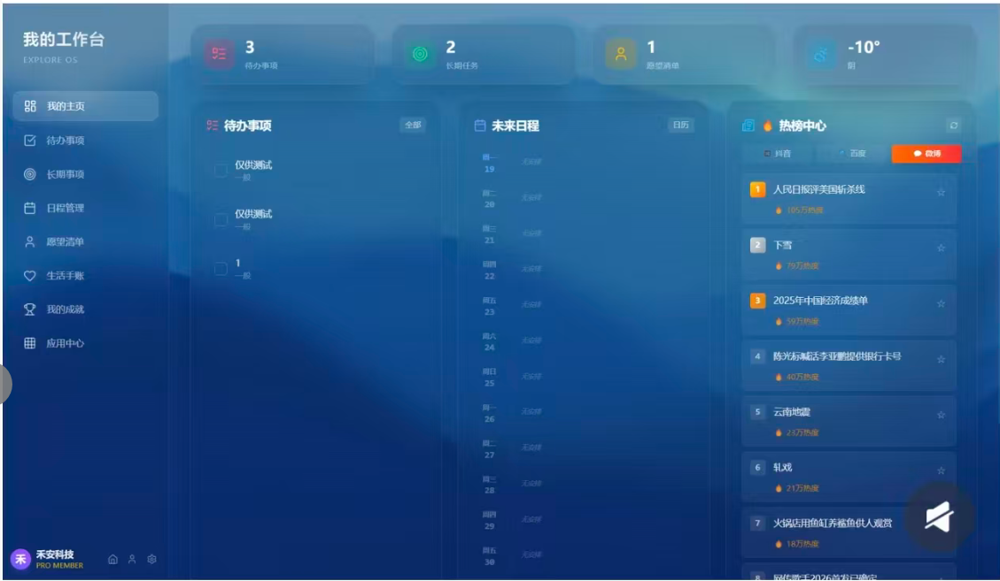

# FlowBoard - 个人工作台

[](https://github.com/Summus1999/FlowBoard/actions)
[](https://opensource.org/licenses/MIT)
[](https://electronjs.org/)

一款跨平台的个人工作台桌面应用，采用现代化的玻璃态 UI 设计，支持多平台账户密码管理、界面UI风格切换、实时资讯整合、LeetCode刷题、GitHub项目追踪等功能。



## 功能特性

### ✅ 已完成的功能

1. **多平台账户密码管理**
   - 卡片式展示各平台账户（12个国内常用账号预设）
   - 分类筛选（社交/工作/金融/娱乐）
   - 密码强度可视化指示（弱/中/强）
   - 一键复制用户名/密码
   - 添加/编辑/删除账户
   - 安全评分圆环显示

2. **界面UI风格切换**
   - 4种主题风格：深海蓝、极光紫、森林绿、简约白
   - 毛玻璃效果开关
   - 动画效果控制
   - 圆角大小调节（0-20px）
   - 主题设置自动保存

3. **实时资讯整合**
   - 热榜展示（AI/科技/财经/娱乐/社会分类）
   - 多平台数据源（微博/知乎/抖音/今日头条）
   - 精美头条区域（动态渐变背景）
   - 热门话题标签

4. **Markdown 笔记编辑器**
   - 三种编辑模式：编辑/预览/分屏
   - 完整的 Markdown 语法支持
   - 代码语法高亮（highlight.js）
   - 自动保存功能
   - 笔记分类管理（工作/学习/生活/灵感）

5. **日程管理日历**
   - 月历视图，支持月份切换
   - 事件分类（工作/个人/重要/其他）
   - 添加/编辑/删除日程
   - 事件提醒指示

6. **LeetCode 刷题集成**
   - 题目列表（支持 API 和本地数据双模式）
   - Monaco Editor 代码编辑器（VS Code 同款）
   - 备用 textarea 编辑器（Monaco 加载失败时自动切换）
   - 代码智能提示（算法模板、常用代码片段）
   - 多语言支持（JavaScript/Python/Java/C++等）
   - 本地模拟运行和提交
   - 提交历史追踪（连续打卡天数统计）

7. **GitHub 项目追踪**
   - 用户名登录（支持 Token 访问私有仓库）
   - 自动显示最近更新的仓库
   - 仓库统计（Stars/Forks/语言/最后提交时间）
   - 用户统计（公开仓库数/关注者数/总星标数）

8. **应用中心**
   - 快速启动本地应用（微信/QQ/VS Code/浏览器等）
   - 自定义添加应用
   - 25种预设图标（含 AI 应用专属图标）
   - 应用可用状态检测

9. **面试追踪**
   - 录音功能（使用 IndexedDB 存储）
   - 面试笔记记录
   - 面试 Checklist
   - 录音回放和下载

10. **个人提升**
    - 学习计划导入（Markdown）
    - 预设学习模板（前端/算法/系统设计）
    - 定时提醒设置
    - 学习统计追踪

11. **实时天气**
    - 自动定位（GPS → IP → 默认城市）
    - 当前温度和天气状况
    - 点击刷新功能
    - 5分钟缓存机制

12. **系统设置**
    - 开机自动启动（Windows/macOS）
    - 启动时最小化
    - 关闭时最小化到托盘

### 其他特性

- 🎨 玻璃态（Glassmorphism）设计风格
- 📱 响应式布局，适配各种屏幕
- 💾 本地数据持久化存储（localStorage + IndexedDB）
- 🔔 系统托盘支持
- ⌨️ 快捷键支持（Ctrl+K 搜索、Ctrl+S 保存等）
- 🔒 Electron 安全最佳实践（contextIsolation + preload）

## 技术栈

- **前端**: HTML5 + CSS3 + JavaScript (ES6+)
- **UI框架**: Tailwind CSS (CDN)
- **图标**: Font Awesome 6
- **编辑器**: Monaco Editor
- **Markdown**: marked.js
- **代码高亮**: highlight.js
- **桌面端**: Electron 28
- **打包工具**: electron-builder

## 🚀 GitHub Actions 自动构建（推荐）

本项目已配置 GitHub Actions，支持自动构建 Windows/macOS/Linux 三平台应用：

1. 进入 GitHub 仓库 **Actions** 页面
2. 选择 **Build and Release** 工作流
3. 点击 **Run workflow** → 输入版本号 → 运行
4. 等待构建完成，在 Artifacts 或 Releases 中下载

详细说明见 [.github/workflows/README.md](.github/workflows/README.md)

## 快速开始

### 环境要求

- Node.js >= 16.x
- npm >= 8.x

### 安装依赖

```bash
npm install
```bash

### 开发模式运行

```bash
# Windows
npm run dev

# macOS/Linux
NODE_ENV=development npm start
```bash

### 构建应用

```bash
# 构建所有平台
npm run build:all

# 仅构建 Windows 版本
npm run build:win

# 仅构建 macOS 版本
npm run build:mac

# 仅构建 Linux 版本
npm run build:linux
```bash

构建后的文件将位于 `dist` 目录中。

## 项目结构

```text
FlowBoard/
├── assets/              # 应用图标和资源
├── build/               # 构建配置
│   └── installer.nsh    # Windows 安装程序脚本
├── css/                 # 样式文件
│   ├── style.css        # 全局样式
│   ├── leetcode.css     # LeetCode 页面
│   ├── notes.css        # 笔记页面
│   ├── calendar.css     # 日程管理
│   ├── github.css       # GitHub 页面
│   ├── growth.css       # 个人提升
│   ├── interview.css    # 面试追踪
│   └── apps.css         # 应用中心
├── js/                  # JavaScript 逻辑
│   ├── app.js           # 主应用逻辑
│   ├── leetcode.js      # LeetCode 模块
│   ├── leetcode-api.js  # LeetCode API
│   ├── code-snippets.js # 代码智能提示
│   ├── notes.js         # 笔记功能
│   ├── calendar.js      # 日程管理
│   ├── github.js        # GitHub 追踪
│   ├── growth.js        # 个人提升
│   ├── interview.js     # 面试追踪
│   └── app-center.js    # 应用中心
├── electron/            # Electron 主进程
│   ├── main.js          # 主进程入口
│   └── preload.js       # 预加载脚本（安全 API 暴露）
├── index.html           # 主页面
├── package.json         # 项目配置
├── README.md            # 项目说明
└── FlowBoard Docs.md    # 详细产品文档
```text

## 开发说明

### 添加新功能

1. 在 `index.html` 中添加界面元素
2. 在 `css/` 目录下创建或修改样式文件
3. 在 `js/` 目录下创建或修改逻辑文件

### 与 Electron 主进程通信

```javascript
// 渲染进程中调用主进程 API
if (window.electronAPI) {
    // 获取平台信息
    const platform = await window.electronAPI.getPlatform();
    
    // 保存数据
    await window.electronAPI.saveData('data.json', { key: 'value' });
    
    // 读取数据
    const result = await window.electronAPI.loadData('data.json');
    
    // 选择文件
    const fileResult = await window.electronAPI.selectFile(options);
    
    // 设置开机启动
    await window.electronAPI.setAutoLaunch(true);
}
```javascript

### Electron 安全架构

本项目采用最新的 Electron 安全最佳实践：

- ✅ `contextIsolation: true` - 启用上下文隔离
- ✅ `nodeIntegration: false` - 禁用 Node 集成
- ✅ `preload` 脚本 - 通过 contextBridge 安全暴露 API
- ✅ 禁用 `remote` 模块

## 快捷键

| 快捷键 | 功能 |
|--------|------|
| `Ctrl/Cmd + K` | 搜索 |
| `Ctrl/Cmd + S` | 保存（笔记/LeetCode） |
| `Ctrl/Cmd + Enter` | 提交（LeetCode） |
| `Tab` | 缩进（Markdown 编辑器） |
| `ESC` | 关闭弹窗 |
| `F5` | 刷新页面 |
| `F11` | 全屏切换 |

## 跨平台注意事项

### macOS

- 应用菜单已本地化（中文）
- 支持黑暗模式
- 关闭窗口时应用保持在 Dock 栏

### Windows

- 支持自定义安装路径
- 自动创建桌面快捷方式
- 支持便携式版本（免安装）

### Linux

- 支持 AppImage、deb、tar.gz 格式
- 开机启动功能暂不支持

## 数据存储位置

- **Windows**: `%APPDATA%/flowboard/`
- **macOS**: `~/Library/Application Support/flowboard/`
- **Linux**: `~/.config/flowboard/`

### 本地存储键值

| 存储 | Key | 用途 |
|------|-----|------|
| localStorage | `todos` | 待办事项 |
| localStorage | `flowboard_notes` | 笔记数据 |
| localStorage | `flowboard_events` | 日程事件 |
| localStorage | `github_username` | GitHub 登录信息 |
| localStorage | `leetcode_submissions` | LeetCode 提交历史 |
| IndexedDB | `FlowBoardInterviewDB` | 面试录音文件 |

## 贡献指南

1. Fork 本项目
2. 创建功能分支 (`git checkout -b feature/AmazingFeature`)
3. 提交更改 (`git commit -m 'Add some AmazingFeature'`)
4. 推送到分支 (`git push origin feature/AmazingFeature`)
5. 创建 Pull Request

## 许可证

MIT License - 详见 [LICENSE](LICENSE) 文件

## 联系方式

如有问题或建议，欢迎提交 Issue 或 Pull Request。

---

## 更新日志

### v1.2 (2026-02-23)
- 新增实时天气功能（自动定位、温度显示）
- Electron 安全加固（contextIsolation + preload）
- 应用中心新增 AI 图标选项（机器人、芯片、代码图标）
- LeetCode 编辑器优化（AMD loader 检测、备用编辑器）
- GitHub 初始化优化（防止重复初始化）
- 移除主页「新消息」装饰功能
- 资讯中心头条区域美化（动态渐变背景）

### v1.1 (2026-02-23)
- 新增开机启动设置
- 新增 LeetCode 代码智能提示
- 新增 GitHub 登录功能
- 新增应用中心（替换提交记录）
- UI 动效优化

### v1.0 (2026-02-23)
- 初始版本发布
- 账户密码管理、资讯中心、待办事项、笔记、日程、面试追踪、LeetCode、GitHub 等功能
